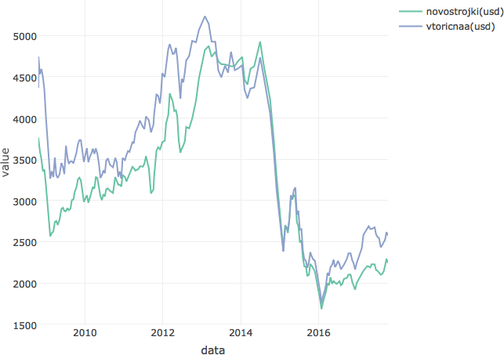
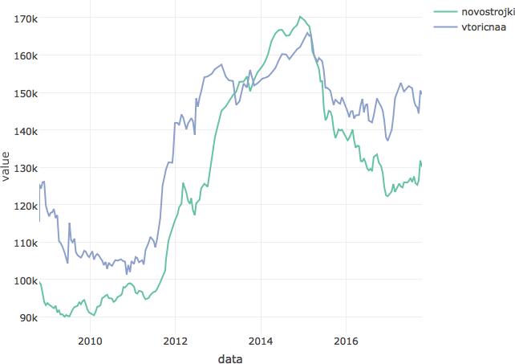
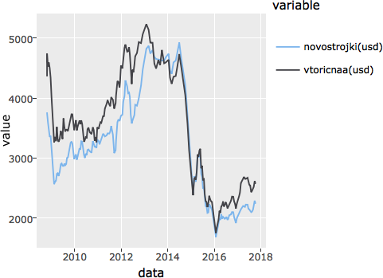

Загрузка нужных пакетов и хорошие настройки
===========================================

    options(scipen = 10, digits = 2, OutDec = '.')
    knitr::opts_chunk$set(
      cache = TRUE
      , echo = FALSE
      , autodep = TRUE
      , encoding = "UTF-8"
      , dpi = 96
      , global.par = TRUE
      , par = TRUE
      , crop = TRUE
      , comment = NA
      , warning = FALSE
      )

Источники
=========

-   Информация по проекту реновации

Достоточно много информации есть на сайте РБК:
<https://realty.rbc.ru/news/577d16e89a7947e548ea49f3>

Там мы возьмем даты событий, чтобы именно около них искать всплески
(часть лежит в `events.csv`).

-   Change point analysis

<https://stats.stackexchange.com/questions/60245/penalty-value-in-changepoint-analysis/60440>

-   Granger causality interpretation using R

<https://stats.stackexchange.com/questions/131261/granger-causality-interpretation-using-r>

    Input object size:   11792 bytes;    11 variables    182 observations
    New object size:    17144 bytes;    11 variables    182 observations

    Input object size:   11792 bytes;    11 variables    182 observations
    New object size:    17144 bytes;    11 variables    182 observations

    Input object size:   11792 bytes;    11 variables    182 observations
    New object size:    17144 bytes;    11 variables    182 observations

Что у нас в данных?
===================

Разбивка по дням
----------------

<table style="width:62%;">
<colgroup>
<col width="8%" />
<col width="9%" />
<col width="8%" />
<col width="11%" />
<col width="8%" />
<col width="8%" />
<col width="8%" />
</colgroup>
<thead>
<tr class="header">
<th align="center">Mon</th>
<th align="center">Tues</th>
<th align="center">Wed</th>
<th align="center">Thurs</th>
<th align="center">Fri</th>
<th align="center">Sat</th>
<th align="center">Sun</th>
</tr>
</thead>
<tbody>
<tr class="odd">
<td align="center">8</td>
<td align="center">74</td>
<td align="center">73</td>
<td align="center">19</td>
<td align="center">8</td>
<td align="center">0</td>
<td align="center">0</td>
</tr>
</tbody>
</table>

Разбивка по годам
-----------------

<table style="width:97%;">
<colgroup>
<col width="9%" />
<col width="9%" />
<col width="9%" />
<col width="9%" />
<col width="9%" />
<col width="9%" />
<col width="9%" />
<col width="9%" />
<col width="9%" />
<col width="9%" />
</colgroup>
<thead>
<tr class="header">
<th align="center">2008</th>
<th align="center">2009</th>
<th align="center">2010</th>
<th align="center">2011</th>
<th align="center">2012</th>
<th align="center">2013</th>
<th align="center">2014</th>
<th align="center">2015</th>
<th align="center">2016</th>
<th align="center">2017</th>
</tr>
</thead>
<tbody>
<tr class="odd">
<td align="center">7</td>
<td align="center">25</td>
<td align="center">24</td>
<td align="center">21</td>
<td align="center">18</td>
<td align="center">11</td>
<td align="center">12</td>
<td align="center">23</td>
<td align="center">24</td>
<td align="center">17</td>
</tr>
</tbody>
</table>

Анализ
======

Цена в долларах США
-------------------

    No trace type specified:
      Based on info supplied, a 'scatter' trace seems appropriate.
      Read more about this trace type -> https://plot.ly/r/reference/#scatter

Убираем страшные выбросы в конце данных

График рублевых цен на новостройки и вторичку:

    No trace type specified:
      Based on info supplied, a 'scatter' trace seems appropriate.
      Read more about this trace type -> https://plot.ly/r/reference/#scatter

    We recommend that you use the dev version of ggplot2 with `ggplotly()`
    Install it with: `devtools::install_github('hadley/ggplot2')`

    Don't know how to automatically pick scale for object of type labelled/integer. Defaulting to continuous.

Определение выбросов
--------------------

### Классификация выбросов

Five types of outliers can be considered.

By default:

-   "AO" additive outliers,

-   "LS" level shifts,

-   "TC" temporary changes are selected;

Manualy you can add:

"IO" innovative outliers and "SLS" seasonal level shifts can also be
selected

Futher info is here: <https://jalobe.com/blog/tsoutliers/>

    Call:
    structure(list(method = NULL), .Names = "method")

    Coefficients:
            ma1   sma1  TC81   AO93  TC96  TC104  LS130  LS158  TC181
          -0.36  -0.36  5747  -4512  4511  -5170  -6239   4693   5519
    s.e.    NaN    NaN  1141    888  1159   1141   1295   1303   1248

    sigma^2 estimated as 2068554:  log likelihood = -1564,  aic = 3149

    Outliers:
      type ind time coefhat tstat
    1   TC  81   81    5747  5.04
    2   AO  93   93   -4512 -5.08
    3   TC  96   96    4511  3.89
    4   TC 104  104   -5170 -4.53
    5   LS 130  130   -6239 -4.82
    6   LS 158  158    4693  3.60
    7   TC 181  181    5519  4.42

               data       novostrojki novostrojki(usd) novostrojki(eur)
    2012-03-06 2012-03-06 125833      4296             3255            
    2012-10-02 2012-10-02 124788      3993             3108            
    2013-01-29 2013-01-29 145139      4825             3588            
    2013-10-01 2013-10-01 150295      4627             3430            
    2015-06-24 2015-06-24 145847      2691             2389            
    2016-08-24 2016-08-24 132733      2049             1807            
    2017-09-27 2017-09-27 131789      2291             1937            
               vtoricnaa vtoricnaa(usd) vtoricnaa(eur) elitnaanedvizimost
    2012-03-06 143368    4895           3709           240966            
    2012-10-02 154272    4936           3843           194111            
    2013-01-29 157440    5234           3892           209101            
    2013-10-01 156022    4803           3561           243211            
    2015-06-24 155770    2874           2551           242744            
    2016-08-24 143813    2220           1957           235449            
    2017-09-27 150493    2616           2212           223662            
               elitnaanedvizimost(usd) elitnaanedvizimost(eur) neft price 
    2012-03-06  8227                    6234                   122  134600
    2012-10-02  6211                    4835                   111  139530
    2013-01-29  6952                    5169                   114  151290
    2013-10-01  7487                    5551                   107  153158
    2015-06-24  4478                    3976                    64  150808
    2016-08-24  3635                    3205                   <NA> 138273
    2017-09-27  3889                    3288                   <NA> 141141

               type ind time coefhat tstat       data novostrojki
    2012-03-06   TC  81   81    5747   5.0 2012-03-06      125833
    2012-10-02   AO  93   93   -4512  -5.1 2012-10-02      124788
    2013-01-29   TC  96   96    4511   3.9 2013-01-29      145139
    2013-10-01   TC 104  104   -5170  -4.5 2013-10-01      150295
    2015-06-24   LS 130  130   -6239  -4.8 2015-06-24      145847
    2016-08-24   LS 158  158    4693   3.6 2016-08-24      132733
    2017-09-27   TC 181  181    5519   4.4 2017-09-27      131789
               novostrojki(usd) novostrojki(eur) vtoricnaa vtoricnaa(usd)
    2012-03-06             4296             3255    143368           4895
    2012-10-02             3993             3108    154272           4936
    2013-01-29             4825             3588    157440           5234
    2013-10-01             4627             3430    156022           4803
    2015-06-24             2691             2389    155770           2874
    2016-08-24             2049             1807    143813           2220
    2017-09-27             2291             1937    150493           2616
               vtoricnaa(eur) elitnaanedvizimost elitnaanedvizimost(usd)
    2012-03-06           3709             240966                    8227
    2012-10-02           3843             194111                    6211
    2013-01-29           3892             209101                    6952
    2013-10-01           3561             243211                    7487
    2015-06-24           2551             242744                    4478
    2016-08-24           1957             235449                    3635
    2017-09-27           2212             223662                    3889
               elitnaanedvizimost(eur) neft  price
    2012-03-06                    6234  122 134600
    2012-10-02                    4835  111 139530
    2013-01-29                    5169  114 151290
    2013-10-01                    5551  107 153158
    2015-06-24                    3976   64 150808
    2016-08-24                    3205 <NA> 138273
    2017-09-27                    3288 <NA> 141141

### Оптимальное разбиение

         Optimal 5-segment partition: 

    Call:
    breakpoints.formula(formula = dat.ts ~ 1)

    Breakpoints at observation number:
    68 95 128 155 

    Corresponding to breakdates:
    68 95 128 155 

### График с событиями и ценами

    Using ',' as decimal and '.' as grouping mark. Use read_delim() for more control.

    Parsed with column specification:
    cols(
      date = col_number(),
      description = col_character(),
      weigth = col_integer()
    )

    Don't know how to automatically pick scale for object of type labelled/integer. Defaulting to continuous.

To bee continued
